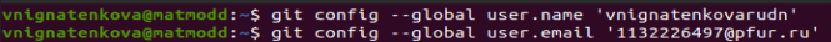
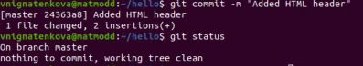
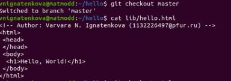
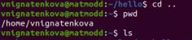
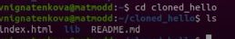
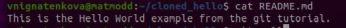

---
## Front matter
title: "Отчёт по лабораторной работе №1"
## subtitle: "Работа с git"
author: "Игнатенкова Варвара Николаевна"

## Generic otions
lang: ru-RU
toc-title: "Содержание"

## Bibliography
csl: pandoc/csl/gost-r-7-0-5-2008-numeric.csl

## Pdf output format
toc: true # Table of contents
toc-depth: 2
lof: true # List of figures
lot: true # List of tables
fontsize: 12pt
linestretch: 1.5
papersize: a4
documentclass: scrreprt
## I18n polyglossia
polyglossia-lang:
  name: russian
  options:
	- spelling=modern
	- babelshorthands=true
polyglossia-otherlangs:
  name: english
## I18n babel
babel-lang: russian
babel-otherlangs: english
## Fonts
mainfont: IBM Plex Serif
romanfont: IBM Plex Serif
sansfont: IBM Plex Sans
monofont: IBM Plex Mono
mathfont: STIX Two Math
mainfontoptions: Ligatures=Common,Ligatures=TeX,Scale=0.94
romanfontoptions: Ligatures=Common,Ligatures=TeX,Scale=0.94
sansfontoptions: Ligatures=Common,Ligatures=TeX,Scale=MatchLowercase,Scale=0.94
monofontoptions: Scale=MatchLowercase,Scale=0.94,FakeStretch=0.9
mathfontoptions:
## Biblatex
biblatex: true
biblio-style: "gost-numeric"
biblatexoptions:
  - parentracker=true
  - backend=biber
  - hyperref=auto
  - language=auto
  - autolang=other*
  - citestyle=gost-numeric
## Misc options
indent: true
header-includes:
  - \usepackage{indentfirst}
  - \usepackage{float} # keep figures where there are in the text
  - \floatplacement{figure}{H} # keep figures where there are in the text
---

# Цель работы

Знакомство с git и изучение его работы.

# Теоретическое введение

Git — распределённая система управления версиями. Проект был создан Линусом Торвальдсом для управления разработкой ядра Linux, первая версия выпущена 7 апреля 2005 года; координатор — Дзюн Хамано. 

# Выполнение лабораторной работы

## Подготовка
Установка имени и электронной почты
Установим имя и электронную почту для установки git

{#fig:001 width=70%}

Параметры установки окончаний строк
Настроим core.autocrlf с параметрами true и input для перевода
строк текстовых файлов в главном репозитории в одинаковый формат.

{#fig:002 width=70%}

Установка отображения unicode
Установим отображение unicode.

{#fig:003 width=70%}

## Создание проекта

Создание страницы «Hello,World» 
Создадим пустой католог с именем hello и создадим файл hello.html.

{#fig:004 width=70%}

Создание репозитория 
Создадим git репозиторий с помощью команды git init.

{#fig:005 width=70%}

Добавление файла в репозиторий
Добавим файл в репозиторий.

{#fig:006 width=70%}

Проверка состояние репозитория
Проверим состояние репозитория.

{#fig:007 width=70%}

Команда проверки состояния сообщит, что коммитить нечего.

## Внесение изменений
Изменим страницу «Hello,World»
Добавим HTML-теги в файле hello.html.

{#fig:008 width=70%}

Проверим состояние рабочего каталога.

{#fig:009 width=70%}

Git знает, что файл hello.html был изменен,но при этом эти изменения еще не зафиксированы в репозитории.

## Индексация изменений

Коммит изменений
Проиндексируем изменения командой git и проверим состояние.

{#fig:010 width=70%}

Изменения файла hello.html были проиндексированы. Это означает,что gitте
перь знает об изменении,но изменение пока не записано в репозиторий.Следующий коммит будет включать в себя проиндексированные изменения.

Сделаем коммит без метки -m.

{#fig:011 width=70%}

После открытия первой строки введем комментарий, сохраним файл и выйдем из редактора. Еще раз проверим состояние.

{#fig:012 width=70%}

Рабочий каталог чистый, продолжим работу.

Добавим стандартные теги страницы
Измените страницу «Hello,World»,чтобы она содержала стандартные теги html и body.

{#fig:013 width=70%}

Теперь добавим это изменение в индекс git.

{#fig:014 width=70%}

Tеперь добавим заголовки HTML (секцию head) к странице «Hello,World».

{#fig:015 width=70%}

Проверим текущий статус.

{#fig:016 width=70%}

Hello.html указан дважды в состоянии. Первое изменение (добавление стандартных тегов) проиндексировано и готово к коммиту. Второе изменение(добавление заголовков HTML) является непроиндексированным.

Произведем коммит проиндексированного изменения, а затем еще раз проверим состояние.

{#fig:017 width=70%}

Состояние команды говорит о том, что hello.html имеет незафиксированные изменения, но уже не в буферной зоне.

Теперь добавьте второе изменение в индекс, а затем проверьте состояние с
помощью команды git status.

{#fig:018 width=70%}

Сделаем коммит второго изменения.

{#fig:019 width=70%}

История

Получим список произведенных изменений.

{#fig:020 width=70%}

Однострочный форматистории:

{#fig:021 width=70%}

Есть много вариантов отображениялога.

{#fig:022 width=70%}

Справочная страница:

{#fig:023 width=70%}

Получение старых версий

Получим хэши предыдущих версий.

{#fig:024 width=70%}

Изучим данные лога и найдем хэш для первого коммита. Используем этот хэш-код в команде ниже. Затем проверим содержимое файла hello.html.

{#fig:025 width=70%}

Вернемся к последней версии в ветке master.

Создание тегов версий
Давайте назовем текущую версию страницы hello первой (v1). Создадим тег первой версии.

{#fig:026 width=70%}

Давайте создадим тегдля версии, которая идет передтекущей версией и назовем его v1-beta. В первую очередьнам надо переключиться на предыдущую версию. Вместо поиска до хэш,мы будем использовать ^, обозначающее «родитель v1».

{#fig:027 width=70%}

Это версия c тегами html и body,но еще пока без head.Давайте сделаем ее версией v1-beta.

{#fig:028 width=70%}

Переключение по имени тега
Теперь попробуем попереключаться между двумя отмеченными версиями.

{#fig:029 width=70%}

Просмотр тегов с помощью команды tag
Мы можем еувидеть,какие теги доступны, используя команду git tag.

{#fig:030 width=70%}

Мы так же можем посмотреть теги в логе.

{#fig:031 width=70%}

Мы можем видеть теги (v1 и v1-beta) в логе вместе с именем ветки (master). Кроме того HEAD показывает коммит, на который выпереключились(наданный момент это v1-beta).

## Отмена локальных изменений (до индексации)

Переключимся на ветку master
Убедимся,что мф находимся на последнем коммите ветки master, прежде чем
продолжить работу.

{#fig:032 width=70%}

Изменим hello.html
Внесем изменение в файл hello.html в виде нежелательного комментария.

{#fig:033 width=70%}

Проверим состояние
Сначала проверим состояние рабочего каталога.

{#fig:034 width=70%}

Мы видим, что файл hello.html был изменен, но еще не проиндексирован.
Отмена изменений в рабочем каталоге
Используем команду git checkout для переключения версии файла hello.html в репозитории.

{#fig:035 width=70%}

Команда git statusпоказываетнам,чтонебылопроизведено никаких изме
нений,не зафиксированных в рабочем каталоге.

## Отмена проиндексированных изменений (перед коммитом)

Изменим файл и проиндексируем изменения
Внесем изменение в файл hello.html в виде нежелательного комментария.

{#fig:036 width=70%}

Проиндексируем это изменение.
Проверим состояние
Проверим состояние нежелательного изменения.

{#fig:037 width=70%}

Состояние показывает,что изменение было проиндексировано и готово к ком
миту.
Выполним сброс буферной зоны
Выполним отмену индексации изменения.

{#fig:038 width=70%}

Команда git reset сбрасывает буферную зону к HEAD.Это очищает буферную зону от изменений, которые мы только что проиндексировали.
Команда git reset (по умолчанию) не изменяет рабочий каталог. Поэтому рабочий каталог все еще содержитнежелательный комментарий. Мы можем использовать команду git checkout, чтобы удалитьнежелательные изменения в рабочем каталоге.
Переключимся на версию коммита

{#fig:039 width=70%}

Наш рабочий каталог опять чист.

## Отмена коммитов
Отмена коммитов
Мы отменим коммит путем создания нового коммита, отменяющего нежелательные изменения.
Изменим файл и сделаем коммит
Изменим файл hello.html на следующий.

{#fig:040 width=70%}

Выполним следующие команды:

{#fig:041 width=70%}

Сделаем коммит с новыми изменениями,отменяющими предыдущие
Чтобы отменить коммит,нам необходимо сделать коммит, который удаляет изменения, сохраненные нежелательным коммитом.

{#fig:042 width=70%}

Проверим лог
Проверка лога показывает нежелательные и отмененные коммиты в наш репозиторий.

{#fig:043 width=70%}

## Удаление коммиттов из ветки
Проверим нашу историю
Давайте сделаем быструю проверку нашей истории коммитов.

{#fig:044 width=70%}

Мы видим, что два последних коммита в этой ветке — «Oops» и «Revert Oops». Давайте удалим их с помощью сброса.
Для начала отметим эту ветку
Но прежде чем удалить коммиты, давайте отметим последний коммит тегом, чтобы потом можно было его найти.

{#fig:045 width=70%}

Сброс коммитов к предшествующим коммиту Oops
Глядя на историю лога, мы видим, что коммит с тегом «v1» является коммитом, предшествующим ошибочному коммиту. Давайте сбросим ветку до этой точки с помощью тега.

{#fig:046 width=70%}

Ничего никогда не теряется
Давайте посмотрим на все коммиты.

{#fig:047 width=70%}

Мы видим, что ошибочные коммиты не исчезли. Они все еще находятся в репозитории. Просто они отсутствуют в ветке master.
Опасность сброса
Сброс влокальных ветках, как правило, безопасен. Последствия любой «аварии» как правило, можно восстановить простым сбросом с помощью нужного коммита.

## Удаление тега oops
Удаление тега oops
Тег oops свою функциювыполнил. Давайте удалим его и коммиты, на которые он ссылался, сборщиком мусора.

{#fig:048 width=70%}

Тег «oops» больше не будет отображаться в репозитории.

## Внесение изменений в коммиты
Изменим страницу,а затем сделаем коммит
Добавим в страницу комментарий автора (вставим свою фамилию).

{#fig:049 width=70%}

Выполним:

{#fig:050 width=70%}

Необходим email
Обновим страницу hello, включив в нее email.

{#fig:051 width=70%}

Изменим предыдущий коммит
Выполним:

{#fig:052 width=70%}

Просмотр истории
Выполним:

{#fig:053 width=70%}

Мы можем увидеть, что оригинальный коммит «автор» заменен коммитом «ав
тор/email». Этого же эффекта можно достичь путем сброса последнего коммита в ветке, и повторного коммита новых изменений.

## Перемещение файлов
Переместим файл hello.html в каталог lib
Сейчас мы собираемся создатьструктуру нашего репозитория. Давайте перенесем страницу в каталог lib.

{#fig:054 width=70%}

Перемещая файлы с помощью git mv, мы информируем git о 2 вещах:
• Что файл hello.html был удален.
• Что файл lib/hello.html был создан.
Оба этих факта сразу же проиндексированы и готовы к коммиту. Команда git
status сообщает,что файл был перемещен.

## Второй способ перемещения файлов
Следующий набор команд идентичен нашим последним действиям. Работы здесь побольше, но результат тот же.
Мы могли бы выполнить:
 mkdir lib
 mv hello.html lib
 git add lib/hello.html
 git rm hello.html
Коммит в новый каталог
Давайте сделаем коммит этого перемещения:

{#fig:055 width=70%}

## Подробнее о структуре

Добавление index.html
Добавим файл index.html в наш репозиторий.

{#fig:056 width=70%}

Добавим файл и сделаем коммит.

{#fig:057 width=70%}

Теперь при открытии index.html, мы должны увидеть кусок страницы hello в
маленьком окошке.

{#fig:058 width=70%}

## Git внутри: Каталог.git
Каталог .git
Выполним:

{#fig:059 width=70%}

Это каталог,в котором хранится вся информация git.
База данных объектов
Выполним:

{#fig:060 width=70%}

Мы видим набор каталогов, имена которых состоят из 2 символов. Имена каталогов являются первыми двумя буквами хэша sha1 объекта, хранящегося в git.
Углубляемся в базу данных объектов
Выполним:

{#fig:061 width=70%}

Смотрим в один из каталогов с именем из 2 букв. Мы видим файлы с именами из 38 символов. Это файлы, содержащие объекты, хранящиеся в git. Они сжаты и закодированы, поэтому просмотр их содержимого нам мало чем поможет.
Config File
Выполним:

{#fig:062 width=70%}

Это файл конфигурации, создающийся для каждого конкретного проекта. Записи в этом файле будут перезаписывать записи в файле .gitconfig нашего главного каталога, по крайней мере в рамках этого проекта.
Ветки и теги
Выполним:

{#fig:063 width=70%}

Каждый файл соответствует тегу, ранее созданному с помощью команды git tag. Его содержание — это всего лишь хэш коммита, привязанный к тегу.
Файл HEAD
Выполним:

{#fig:064 width=70%}

Файл HEAD содержит ссылку на текущую ветку, в данный момент это должна быть ветка master.

## Работа непосредственно с объектами git
Поиск последнего коммита
Выполним:

{#fig:065 width=70%}

Эта команда должна показать последний коммит в репозиторий. SHA1 хэш в нашей системе, вероятно, отличается от моего, но мы увидим что-то наподобие этого.
Вывод последнего коммита с помощью SHA1 хэша
Выполним:

{#fig:066 width=70%}

Поиск дерева
Мы можем вывести дерево каталогов, ссылка на который идет в коммите.Это должно быть описание файлов (верхнего уровня) в нашем проекте (для конкретного коммита). Используем SHA1 хэш из строки «дерева».

{#fig:067 width=70%}

Вывод каталога lib
Выполним:

{#fig:068 width=70%}

Вывод файла hello.html
Выполним:

{#fig:069 width=70%}

Исследуем самостоятельно
Нахождение оригинального файла hello.html с самого первого коммита вручную по ссылкам SHA1 хэша в последнем коммите.

{#fig:070 width=70%}

## Создание ветки
Пора сделать наш hello world более выразительным. Так как это может занять некоторое время, лучше переместить эти изменения в отдельную ветку, чтобы изолировать их отизменений в ветке master.
Создадим ветку
Давайте назовем нашу новую ветку «style».

{#fig:071 width=70%}

Добавим файл стилей style.css
Выполним:

{#fig:072 width=70%}

Файл стилей:

{#fig:073 width=70%}

Изменим основную страницу
Обновим файл hello.html, чтобы использовать стили style.css.

{#fig:074 width=70%}

Выполним:

{#fig:075 width=70%}

Изменим index.html
Обновим файл index.html, чтобы он тоже использовал style.css.

{#fig:076 width=70%}

Выполним:

{#fig:077 width=70%}

## Навигация по веткам
Теперь в вашем проекте есть две ветки:

{#fig:078 width=70%}

Переключение на ветку master
Используем команду git checkout для переключения междуветками:

{#fig:079 width=70%}

Сейчас мы находимся на ветке master. Это заметно по тому, что файл hello.html не использует стили style.css.
Вернемся к ветке style
Выполним:

{#fig:080 width=70%}

Содержимое lib/hello.html подтверждает,что мы вернулись на ветку style.

## Изменения в ветке master
Пока вы меняли ветку style, кто-то решил обновить ветку master. Они добавили файл README.md.
Создайте файл README в ветке master
Создадим файл README.md.

{#fig:081 width=70%}

## Сделаем коммит изменений README.md в ветку master.
Выполним:

{#fig:082 width=70%}

Просмотр отличающихся веток
Просмотр текущих веток
Теперь у нас в репозитории есть две отличающиеся ветки. Используем следующую лог-команду для просмотра веток и их отличий.

{#fig:083 width=70%}

## Слияние
Слияние веток
Слияние переносит изменения из двух веток в одну. Давайте вернемся к ветке style исольем masterсstyle.

{#fig:084 width=70%}

## Создание конфликта
Вернемся в master и создадим конфликт
Вернемся в ветку master и внесем следующие изменения:

{#fig:085 width=70%}

Файлlib/hello.html

{#fig:086 width=70%}

Выполним:

{#fig:087 width=70%}

Просмотр веток
Выполним:

{#fig:088 width=70%}

После коммита «Added README» ветка master была объединена с веткой style,но внастоящее время в master естьдополнительный коммит, который не был слит с style.
Последнее изменение в master конфликтует с некоторыми изменениями в style. На следующем шаге мы решим этот конфликт.

## Разрешение конфликтов
Слияние master с веткой style
Теперь вернемся к ветке style и попытаемся объединить ее с новой веткой master.

{#fig:089 width=70%}

Откроем lib/hello.html.

{#fig:090 width=70%}

Первый раздел—версиятекущей ветки (style).Второй раздел—версия ветки master.
Решение конфликта
Внесем изменения в lib/hello.html для достижения следующего результата.

{#fig:091 width=70%}

Сделаем коммит решения конфликта
Выполним:

{#fig:092 width=70%}

Перебазирование как альтернатива слиянию
Мы будем использовать команду reset для возврата веток к предыдущему состоянию.

## Сброс ветки style
Сброс ветки style
Вернемся на ветке style к точке перед тем,как мы слили ее с веткой master.
Выполним:

{#fig:093 width=70%}

Мы видим, что коммит «Updated index.html» был последним на ветке style перед слиянием. Давайте сбросим ветку style к этому коммиту.
Выполним:

{#fig:094 width=70%}

Проверьте ветку.
Выполним:

{#fig:095 width=70%}

## Сброс ветки master
Сброс ветки master
Давайте вернемся в ветке master в точку перед внесением конфликтующих изменений.

{#fig:096 width=70%}

Коммит «Added README» идет непосредственно перед коммитом конфликтующего интерактивного режима. Мы сбросим ветку master к коммиту «AddedREADME».

{#fig:097 width=70%}

Лог должен выглядеть,как будто репозиторий был перемотан назад во времени к точке до какого-либо слияния.

## Перебазирование
Используем команду rebase вместо команды merge.

{#fig:098 width=70%}

Слияние VS перебазирование
Конечный результат перебазирования очень похож на результатслияния. Ветка style в настоящее время содержитвсе свои изменения, а также все изменения ветки master. Однако, дерево коммитов значительно отличается. Дерево коммитов ветки style было переписанотаким образом, что ветка master является частью истории коммитов.Этоделаетцепькоммитовлинейной и гораздо более читабельной.

Не используйте перебазирование:
 • если ветка является публичной и расшаренной, поскольку переписывание
 общихветок будетмешатьработедругих членов команды;
 • когда важна точная история коммитов ветки,так как команда rebase переписывает историю коммитов;

Учитывая приведенные выше рекомендации, рекомендуется использовать git rebase для кратковременных,локальных веток,а слияниедля веток в публичном репозитории.

## Слияние в веткуmaster
Мы поддерживали соответствие ветки style с веткой master (с помощью rebase),теперь давайте сольем изменения style в ветку master.
Слияние style в master
Выполним:

{#fig:099 width=70%}

Поскольку последний коммитветки master прямопредшествуетпоследнему коммиту ветки style, git можетвыполнитьускоренное слияние-перемотку. При быстрой перемотке вперед git просто передвигаетуказательвперед,таким обра
зом указывая натотже коммит,что иветка style.
При быстрой перемотке конфликтов быть не может.
Просмотрим логи
Выполним:

{#fig:100 width=70%}

Теперь ветки style и masterидентичны.

## Клонирование репозиториев
Перейдем в рабочий каталог
Выполним:

{#fig:101 width=70%}

Создадим клон репозитория hello
Выполним:

{#fig:102 width=70%}

В рабочем каталоге теперь должно быть два репозитория: оригинальный репозиторий «hello» и клонированный репозиторий «cloned_hello».

## Просмотр клонированного репозитори
Давайте взглянем на клонированный репозиторий.
Выполним:

{#fig:103 width=70%}

Мы увидим список всех файлов на верхнем уровне оригинального репозитория README.md, index.html и lib.
Просмотрите историю репозитория
Выполним:

{#fig:104 width=70%}

Мы увидим список всех коммитов в новый репозиторий, и он должен (более или менее) совпадать с историей коммитов в оригинальном репозитории.Единственная разницадолжна быть в названиях веток.
Удаленные ветки
Мы увидим ветку master (HEAD) в списке истории. Мы также увидим ветки со странными именами (origin/master,origin/style и origin/HEAD).

## Что такое origin?
Выполним:

{#fig:105 width=70%}

Мы видим, что клонированный репозиторий знает об имени по умолчанию удаленного репозитория. Давайте посмотрим, можем ли мы получить более подробную информацию об имени по умолчанию:

{#fig:106 width=70%}

Удаленные репозитории обычно размещаются на отдельной машине, возможно, централизованном сервере. Однако, как мы видим здесь, они могут с тем же успехом указывать на репозиторий на той же машине. Нет ничего особенного в имени «origin», однако существует традиция использовать «origin» в качестве имени первичного централизованного репозитория (если таковой имеется).

## Удаленные ветки
Выполним:

{#fig:107 width=70%}

Как мы видим, в списке только ветка master. Где ветка style? Команда git branch выводиттолько списоклокальных веток по умолчанию.
Список удаленных веток
Для того, чтобы просмотреть все ветки, выполним:

{#fig:108 width=70%}

Git выводит все коммиты в оригинальный репозиторий, но ветки в удаленном репозитории не рассматриваются как локальные. Если мы хотим собственную ветку style, мы должны сами ее создать.

## Изменение оригинального репозитория
Внесем некоторые изменения в оригинальный репозиторий,чтобы затем попытаться извлечь и слить изменения из удаленной ветки в текущую.
Внесение изменения в оригинальный репозиторий hello
Выполним:

{#fig:109 width=70%}

Внесем следующие изменения в файл README.md: ФайлREADME.md

{#fig:110 width=70%}

Теперь добавим это изменение и сделаем коммит.

{#fig:111 width=70%}

Теперь в оригинальном репозитории естьболее поздние изменения, которых нет в клонированной версии. Далее мы извлечем и сольем эти изменения в клонированный репозиторий.
Извлечение изменений
Выполним:

{#fig:112 width=70%}

Команда git fetch будет извлекать новые коммиты из удаленного репозитория, но не будет сливать их с вашими наработками в локальных ветках.
Проверим README.md
Выполним:

{#fig:113 width=70%}

## Слияние извлеченных изменений
Сольем извлеченные изменения в локальную ветку 
Выполним:

{#fig:114 width=70%}

Еще раз проверим файл README.md
Сейчас мы должны увидеть изменения. Выполним:

{#fig:115 width=70%}

Хотя команда git fetc не сливает изменения, мы можем вручную слить изменения из удаленного репозитория.

## Добавление ветки наблюдения
Ветки, которые начинаются с remotes/origin являются ветками оригинального репозитория.
Добавим локальную ветку,которая отслеживаетудаленную ветку
Выполним:

{#fig:116 width=70%}

Теперь мы можем видеть ветку style в списке веток и логе.

## Чистые репозитории
Чистые репозитории (без рабочих каталогов) обычно используются для расша
ривания.Обычный git-репозиторий подразумевает,что вы будете использовать его как рабочую директорию, поэтому вместе с файлами проекта в актуальной версии, git хранит все служебные, «чисто-репозиториевские» файлы в поддиректории .git. В удаленных репозиториях нет смысла хранить рабочие файлы на диске (как это делается в рабочих копиях), а все что им действительно нужно — это дельты изменений и другие бинарные данные репозитория. Вот это и есть «чистый репозиторий».

## Создадим чистый репозиторий

{#fig:117 width=70%}

Сейчас мы находимся в рабочем каталоге.
Как правило, репозитории, оканчивающиеся на .git являются чистыми репозиториями. Мы видим, что в репозитории hello.git нет рабочего каталога. По сути, это есть не что иное, как каталог.git нечистого репозитория.

##  Добавление удаленного репозитория

Давайте добавим репозиторий hello.git к нашему оригинальному репозиторию.

{#fig:118 width=70%}

## Отправка изменений
Отредактируем файл README.md и сделаем коммит.

{#fig:119 width=70%}

Выполним:

{#fig:120 width=70%}

Теперь отправим изменения в общий репозиторий.

{#fig:121 width=70%}

Общим называется репозиторий, получающий отправленные нами изменения.

## Извлечение общих изменений
Быстро переключимся в клонированный репозиторий и извлечем изменения,только что отправленные в общий репозиторий.

{#fig:122 width=70%}

Выполним:

{#fig:123 width=70%}

# Выводы

Мы ознакомились с работой с git и приобрели соответствующие навыки.

